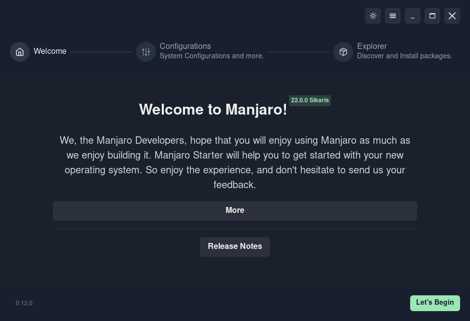
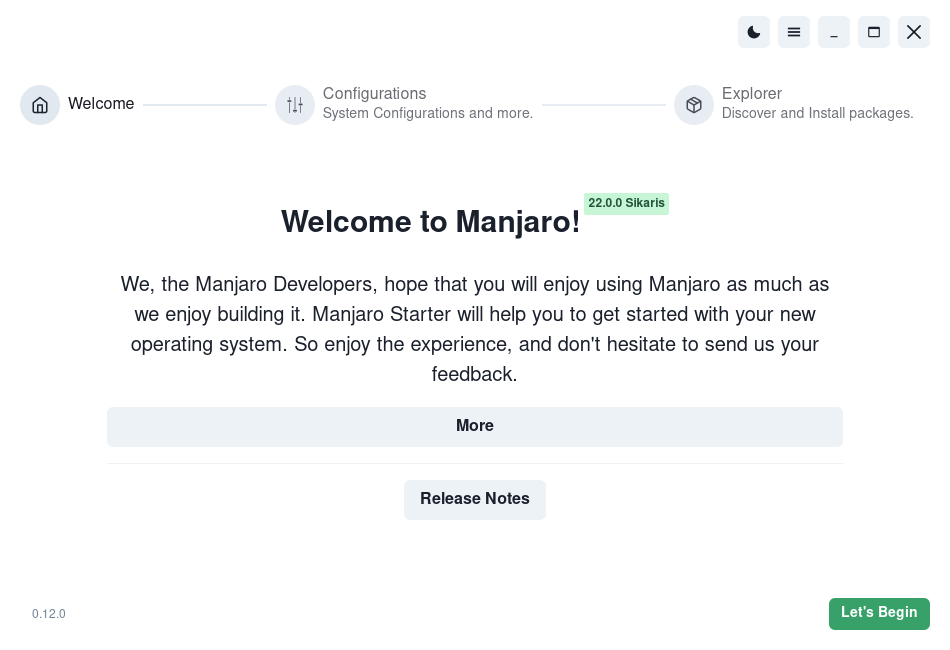
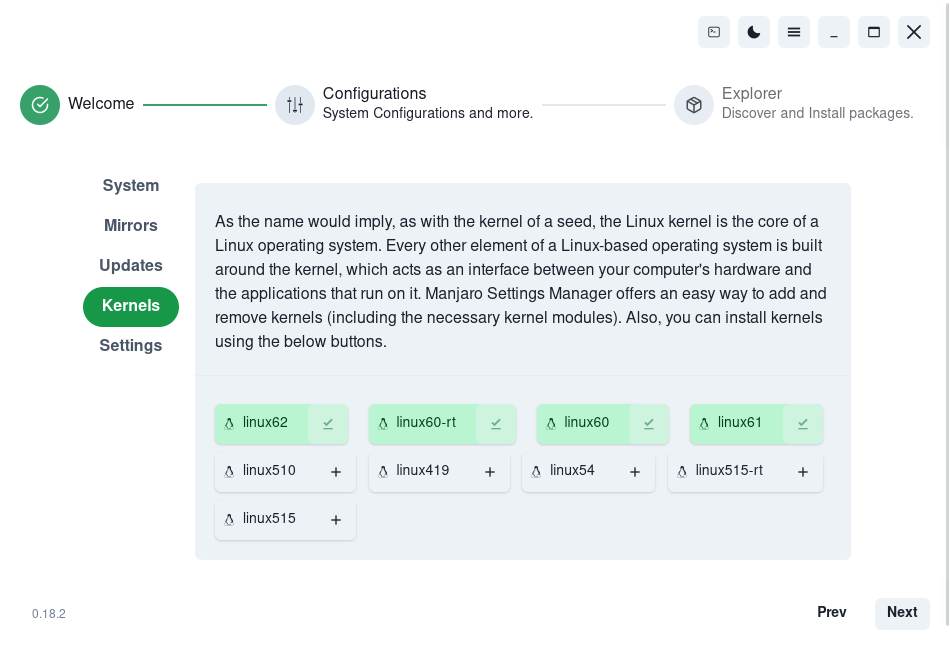
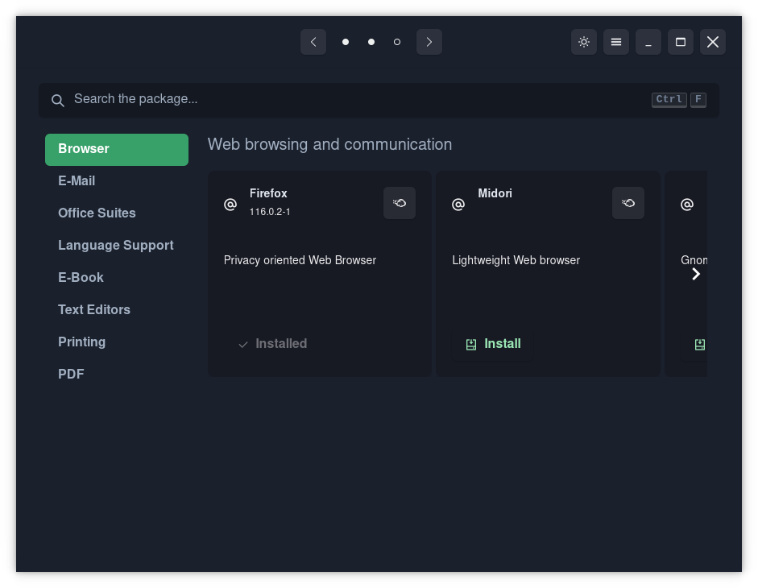

[![Forks][forks-shield]][forks-url]
[![Stargazers][stars-shield]][stars-url]
[![Issues][issues-shield]][issues-url]


<!-- PROJECT LOGO -->
<br />
<p align="center">
  <a href="https://github.com/oguzkaganeren/manjaro-starter">
    
  </a>

  <h3 align="center">Manjaro Starter</h3>

  <p align="center">
    A tool providing access to documentation and support for new Manjaro users.
    <br />
    <br />
    <br />
    <a href="https://github.com/oguzkaganeren/manjaro-starter/">View Demo</a>
    ·
    <a href="https://github.com/oguzkaganeren/manjaro-starter/issues">Report Bug</a>
    ·
    <a href="https://github.com/oguzkaganeren/manjaro-starter/issues">Request Feature</a>
    ·
    <a href="https://github.com/oguzkaganeren/manjaro-starter/pulls">Send a Pull Request</a>
  </p>
</p>

<!-- ABOUT THE PROJECT -->
## About The Project

<p float="left"> 





</p>

## Features

* Steps mechanism
* Release Notes (redirect to Manjaro Blog)
* Showing System Details (System name-version, kernel info, host info, CPU, memory, swap)
* Set fastest mirrors (`pacman-mirrors --fasttrack 5`)
* Check system updates and update system (Open Pamac updates page)
* Install Drivers (Open MSM drivers page)
* Set date time (Open MSM date-time page)
* Install Language Packages (Open MSM Language Packages page)
* List Kernels and Install (Used MHWD cli)
* Most used package list and install them easily
* Translation Support
* Launch at start
* Dark and White color mode

### Dependency

* gtk3
* pamac-cli
* webkit2gtk
* mhwd
* pacman
* pamac-manager
* pkexec

### Dependency(Optional)
* manjaro-settings-manager
* mcp-qt

### Used

* For app icons [Papirus](https://github.com/PapirusDevelopmentTeam/papirus-icon-theme)

### Built With

* [React](https://reactjs.org)
* [Tauri](https://tauri.studio)


<!-- GETTING STARTED -->
## Getting Started

To get a local copy up and running follow these steps.

### Prerequisites

* yarn

### Installation

1. Clone the repo
```sh
git clone https://github.com/oguzkaganeren/manjaro-starter.git
```
2. Install NPM packages
```sh
yarn install
```
3. Run with
```sh
yarn tauri dev
```


<!-- USAGE EXAMPLES -->
## Usage

A PKGBUILD can be found on [Manjaro GitLab](https://gitlab.manjaro.org/packages/extra/manjaro-starter). Also, Binary files will be uploaded to release page each release.

## Logs location
`/home/<host>/.config/com.manjaro.starter`  

<!-- ROADMAP -->
## 🚧 Roadmap

See the [open issues](https://github.com/oguzkaganeren/manjaro-starter/issues) for a list of proposed features (and known issues).


<!-- CONTRIBUTING -->
## 🤝 Contributing

Contributions are what make the open source community such an amazing place to be learn, inspire, and create. Any contributions you make are **extremely appreciated**.

1. Fork the Project
2. Create your Feature Branch (`git checkout -b feature/AmazingFeature`)
3. Commit your Changes (`git commit -m 'Add some AmazingFeature'`)
4. Push to the Branch (`git push origin feature/AmazingFeature`)
5. Open a Pull Request


### Translations

1. Save as `src/translations/en.json` with your local json name
2. Translate only values(do not change keys)
3. Import it at i18n.ts file and add it to resources variable
4. Run `yarn tauri dev` and check your changes
5. Commit all changes
6. Send pull request

<!-- LICENSE -->
## 📝 License

Distributed under the GNU License. See `LICENSE.md` for more information.


<!-- CONTACT -->
## 📫 Contact

Oguz Kagan EREN - [@oguzkagan](https://forum.manjaro.org/u/oguzkagan/summary)

Project Link: [https://github.com/oguzkaganeren/manjaro-starter](https://github.com/oguzkaganeren/manjaro-starter)


<!-- ACKNOWLEDGEMENTS -->
## Acknowledgements
* [yochananmarqos](https://github.com/yochananmarqos)


<!-- MARKDOWN LINKS & IMAGES -->
<!-- https://www.markdownguide.org/basic-syntax/#reference-style-links -->
[forks-shield]: https://img.shields.io/github/forks/oguzkaganeren/manjaro-starter?style=for-the-badge
[forks-url]: https://github.com/oguzkaganeren/manjaro-starter/network/members
[stars-shield]: https://img.shields.io/github/stars/oguzkaganeren/manjaro-starter?style=for-the-badge
[stars-url]: https://github.com/oguzkaganeren/manjaro-starter/stargazers
[issues-shield]: https://img.shields.io/github/issues/oguzkaganeren/manjaro-starter?style=for-the-badge
[issues-url]: https://github.com/oguzkaganeren/manjaro-starter/issues
[linkedin-shield]: https://img.shields.io/badge/-LinkedIn-black.svg?style=flat-square&logo=linkedin&colorB=555
[linkedin-url]: https://linkedin.com/in/roshan-lamichhane
